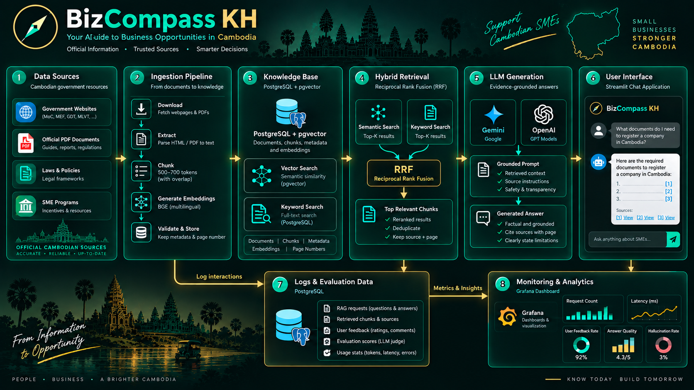
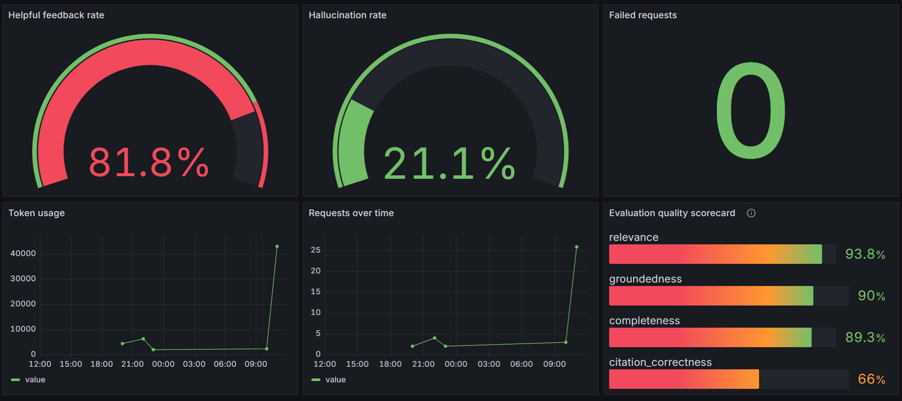

# BizCompass KH

BizCompass KH is a retrieval-augmented assistant for people starting, registering, and operating small and medium enterprises in Cambodia. It answers in the user's language from an evidence-backed knowledge base of Cambodian business guidance, rather than relying on the LLM's general knowledge.

The project was built as an end-to-end project for the [DataTalks.Club LLM Zoomcamp project rubric](https://github.com/DataTalksClub/llm-zoomcamp/blob/main/project.md).

## Problem

Starting a business can require information from several government bodies: business registration, tax, labour, social-security, investment, and SME guidance. These documents are often published as separate web pages and PDFs, making it difficult to find the relevant official step quickly.

BizCompass KH retrieves relevant guidance, generates a concise answer, and links factual claims back to the documents that support them. It is an information assistant, not legal, tax, or professional advice.

## What the project delivers

| Zoomcamp requirement | BizCompass KH implementation |
| --- | --- |
| Dataset / data source | Public Cambodian business-guidance HTML pages and PDFs listed in `data/sources.yaml` |
| Knowledge-base ingestion | `dlt` pipeline downloads, extracts, chunks, embeds, and loads documents into PostgreSQL + pgvector |
| RAG application flow | Hybrid vector and keyword retrieval, Reciprocal Rank Fusion (RRF), prompt construction, provider LLM response, and source links |
| Retrieval evaluation | 75 curated questions; Hit Rate@K, MRR, and Recall@K |
| LLM evaluation | LLM judge scores relevance, groundedness, completeness, citation correctness, and unsupported claims |
| Interface | Streamlit chat application |
| Feedback and monitoring | Per-answer helpful/not-helpful feedback in PostgreSQL and an eight-panel Grafana dashboard |
| Containerization | Dockerfile and Docker Compose for Streamlit, PostgreSQL/pgvector, and Grafana |

## Data

The corpus is not the Zoomcamp FAQ dataset. It consists of public Cambodian business guidance configured in `data/sources.yaml`. Sources may be HTML pages or PDFs and are tagged with agency, topic, category, publication year, source type, and whether they are official.

The template is available at `data/sources.example.yaml`. Create `data/sources.yaml` from it and add the approved public source URLs for your deployment.

During ingestion, BizCompass KH:

1. Downloads each source with a browser-compatible user agent.
2. Extracts text from HTML or preserves page-level text from PDFs.
3. Splits text into overlapping 500–700-token chunks.
4. Creates provider embeddings and stores chunks in PostgreSQL with pgvector.
5. Saves a content hash and embedding fingerprint, so unchanged documents are skipped and changed documents are replaced atomically.
6. Records failed sources without stopping the rest of the run.

## Architecture



## Technology choices

| Tool | Purpose |
| --- | --- |
| Python + `uv` | Application runtime and reproducible locked dependencies |
| `dlt` | Repeatable ingestion pipeline and pipeline metadata |
| PostgreSQL + pgvector | Relational metadata, request logs, feedback, full-text search, and vector search |
| Gemini or OpenAI | One configurable provider for generation, judging, and embeddings |
| Streamlit | Interactive chat interface |
| Grafana | Dashboard over PostgreSQL request, feedback, and evaluation tables |

`dlt`, pgvector, RRF, and Grafana are explained here because they extend the basic RAG flow: `dlt` orchestrates ingestion state, pgvector stores and searches embeddings, RRF merges keyword and semantic rankings, and Grafana visualizes application quality and usage.

## Setup

### Prerequisites

- Python 3.12+
- [uv](https://docs.astral.sh/uv/)
- GNU Make (optional command shortcut; Windows users can use the `uv` fallbacks below)
- Docker Desktop with Docker Compose, for PostgreSQL/pgvector and Grafana
- A Gemini or OpenAI API key

Create your local configuration:

```powershell
Copy-Item .env.example .env
Copy-Item data/sources.example.yaml data/sources.yaml
make setup
```

Without Make, run `uv sync --dev` instead.

Edit `.env`. Do not commit it.

### Gemini configuration

```dotenv
LLM_PROVIDER=gemini
LLM_MODEL=gemini-2.5-flash
GEMINI_API_KEY=your-key
EMBEDDING_MODEL=gemini-embedding-001
EMBEDDING_DIMENSION=1024
```

### OpenAI configuration

```dotenv
LLM_PROVIDER=openai
LLM_MODEL=gpt-5-mini
OPENAI_API_KEY=your-key
EMBEDDING_MODEL=text-embedding-3-small
EMBEDDING_DIMENSION=1024
```

`LLM_PROVIDER` selects the generation provider, evaluator judge, and embedding provider together. Keep `EMBEDDING_DIMENSION` aligned with the selected embedding model.

## Run the application

### Option A: Compose stack

```powershell
make up
make ingest-container
```

The Compose stack is intended to run Streamlit, PostgreSQL/pgvector, and Grafana together. Before using this option, ensure the Compose application services use `postgres:5432` internally and Grafana mounts `monitoring/grafana/provisioning` and `monitoring/grafana/dashboards`. Host-side local commands use `localhost` and the published PostgreSQL port instead.

### Option B: local Streamlit with Docker services

Start the database and dashboard:

```powershell
make services
```

Ingest the configured sources. The command prints each source as it completes and shows percentage progress:

```powershell
make ingest
```

Start the chat UI:

```powershell
make app
```

Open:

- Streamlit: http://localhost:8501
- Grafana: http://localhost:3000

## Example walkthrough

1. Start PostgreSQL and Grafana.
2. Add public source URLs to `data/sources.yaml` and run ingestion.
3. Open Streamlit and ask, for example, “How do I register a business in Cambodia?”
4. Read the answer and open its inline Markdown citation links to inspect source documents.
5. Mark the answer Helpful or Not helpful.
6. Open Grafana to inspect request volume, latency, retrieval counts, feedback, evaluation quality, and hallucination rate.

Good questions are specific, such as:

- “How do I register a business in Cambodia?”
- “Which registrations may an employer need after hiring staff?”
- “What tax-registration steps are described in the available guidance?”

### App demo


If the video preview is not available in your Markdown viewer, [open the demo video](assets/demo.webm).

## Evaluation

The evaluation dataset at `data/eval_questions.json` contains 75 curated questions with expected source IDs and expected-answer guidance.

Run evaluation after ingestion:

```powershell
make evaluate
```

The runner prints percentage progress and stores results in:

- `data/evaluation_results/*.json`
- `data/evaluation_results/*.csv`
- PostgreSQL table `evaluation_scores`

### Retrieval metrics

- Hit Rate@K
- Mean Reciprocal Rank (MRR)
- Recall@K

### LLM-answer metrics

The provider LLM acts as a structured judge and scores each answer from 1 to 5 for:

- relevance
- groundedness
- completeness
- citation correctness

It also records unsupported claims and derives a hallucination flag.

The current automated evaluation measures the hybrid RRF retriever and one prompt configuration. A standalone-vector versus keyword-versus-hybrid ablation is a useful next extension for the rubric's multiple-approach evaluation criterion.

## Feedback and monitoring

Every answer with retrieved evidence offers Helpful and Not helpful controls. Feedback, question text, answer metadata, latency, token counts, retrieval count, errors, and evaluation scores are stored in PostgreSQL.

Grafana is provisioned from `monitoring/grafana/dashboards/bizcompass.json` and queries PostgreSQL directly. Its dashboard includes at least eight panels:

1. requests over time
2. average latency
3. failed requests
4. token usage
5. average retrieved chunks
6. helpful-feedback rate
7. evaluation-quality scorecard
8. hallucination rate

### Evaluation and monitoring dashboard



## Screenshots and preview

The README includes the architecture illustration, Streamlit demo video, and Grafana dashboard screenshot from `assets/`. Before submission, replace them with the latest run if the UI or dashboard changes.

## Database behavior

SQLAlchemy creates the schema and enables the pgvector extension. Main tables are:

- `documents` and `chunks` for the knowledge base
- `ingestion_failures` for isolated source errors
- `rag_requests` and `rag_retrievals` for request monitoring
- `feedback` for user ratings
- `evaluation_scores` for judge results

When an embedding provider, model, or dimension changes, the ingestion fingerprint changes. Re-ingestion refreshes affected document chunks while preserving request, feedback, and evaluation history.

## Quality checks

```powershell
make test
make lint
make format-check
make typecheck
```

Unit tests avoid remote model calls. Integration tests that need PostgreSQL/pgvector are marked `integration`.

Run `make help` to see all available commands. The Makefile calls `uv` internally, so dependency versions continue to come from `uv.lock`.

### Without Make

GNU Make is not included with standard Windows PowerShell. If it is not installed, use these equivalent commands:

| Task | Direct command |
| --- | --- |
| Setup | `uv sync --dev` |
| Ingest | `uv run bizcompass-ingest` |
| Evaluate | `uv run bizcompass-evaluate` |
| Run Streamlit | `uv run streamlit run src/bizcompass_kh/ui/app.py` |
| Test | `uv run pytest` |
| Lint | `uv run ruff check .` |
| Format check | `uv run ruff format --check .` |
| Type check | `uv run pyright` |
